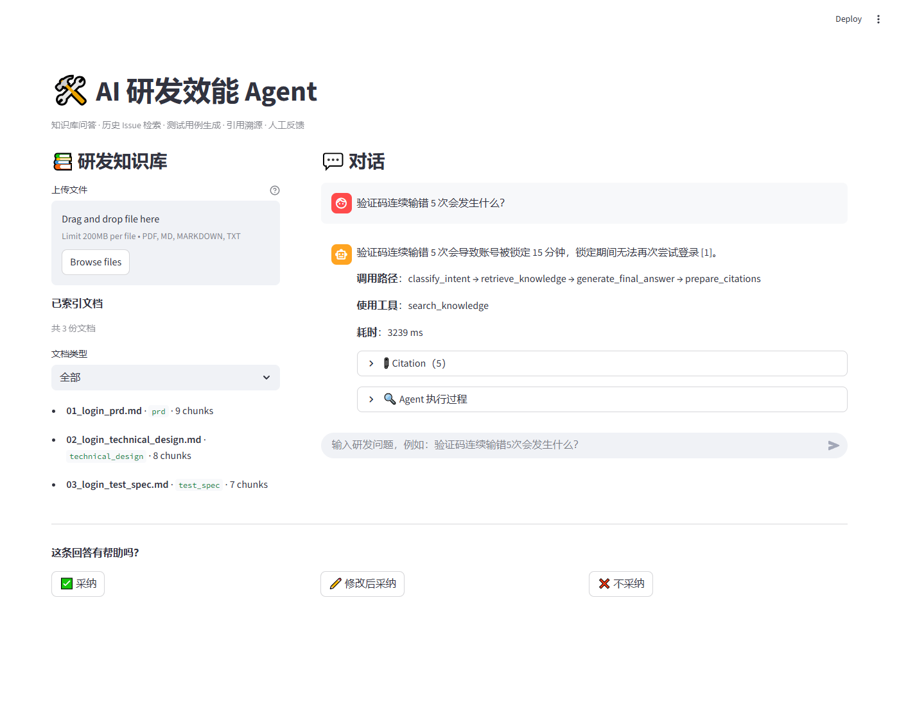
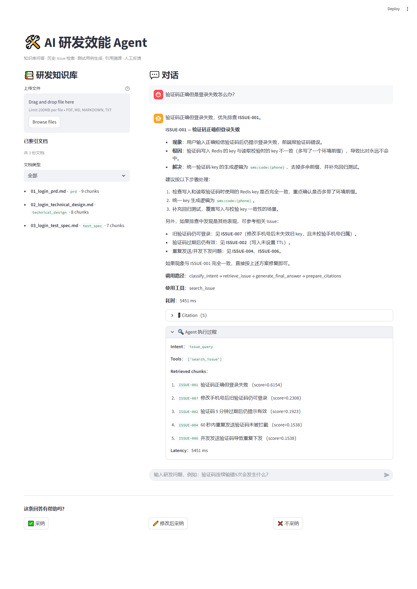
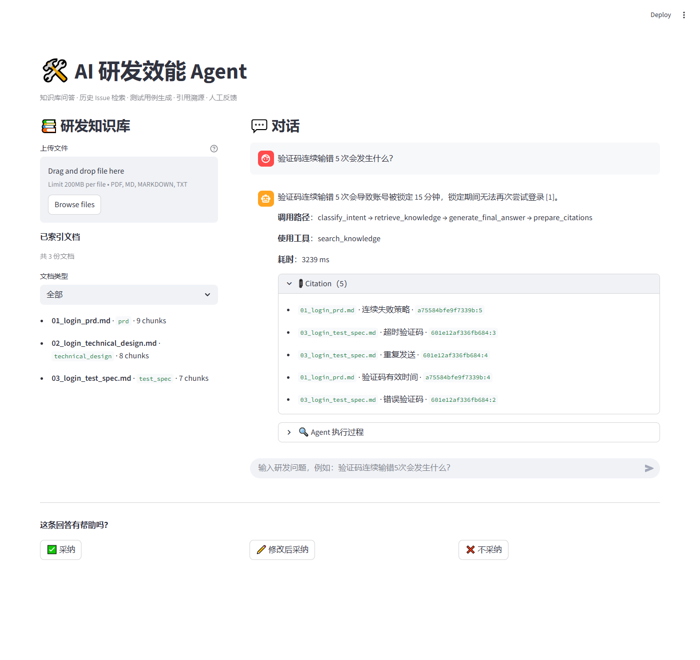
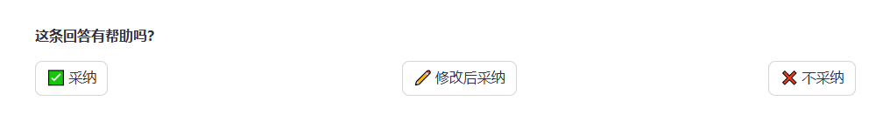
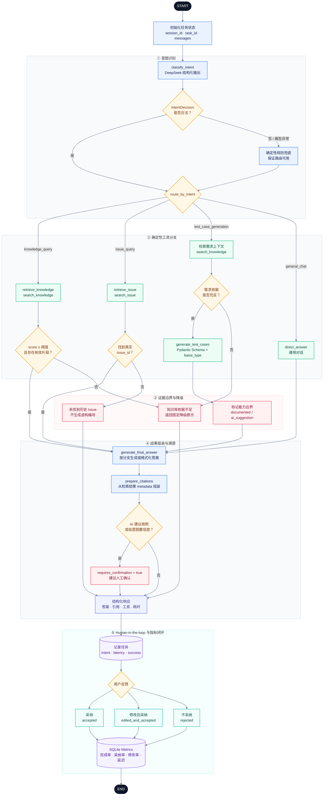

# AI 研发效能 Agent

一个面向研发团队的 **RAG 智能助手**：基于本地知识库（PRD / 技术设计 / 测试资料）与历史 Issue 库，提供**知识问答、历史故障检索、测试用例生成**三大能力，并做到**引用可溯源、答案可人工反馈、指标可量化**。

后端为 **FastAPI + LangGraph**，前端为 **Streamlit**，向量检索使用 **Chroma + 本地 bge-small-zh-v1.5 中文 Embedding**，LLM 使用 **DeepSeek（deepseek-chat）**。



*本地运行的 Streamlit 原型截图；其余执行过程、引用和反馈截图见下方 [Demo 演示](#demo-演示产品截图)。截图展示功能界面，不代表生产部署或用户使用成效。*

## 产品场景

这个原型面向需要查阅研发资料的开发与测试人员：输入问题后，按意图进入知识库问答、历史 Issue 查询或测试用例生成分支。知识回答附检索来源；Issue 分支返回样例库中的已有记录；测试用例区分文档依据与 AI 补充建议。界面允许用户查看执行路径并提交采纳反馈。它用于展示这三类任务的交互与评测方法，尚未验证实际团队使用成效。

## 用户痛点

| 用户 | 痛点 |
| --- | --- |
| 开发工程师 | 技术文档分散，问题定位依赖个人经验与口头传承 |
| 测试工程师 | 测试用例重复编写，边界场景覆盖不足 |
| 团队负责人 | 历史问题与解决方案难沉淀、难复用 |

## 产品能力

- 知识智能问答（检索来源可查看；生成内容仍需核对）
- 历史 Issue 检索（关键词加权打分）
- 测试用例生成（区分「文档依据 / AI 建议」）
- Agent 意图路由（知识 / Issue / 测试用例 / 闲聊 四分类）
- 证据不足如实降级（不强行回答）
- 人工反馈闭环（采纳 / 修改后采纳 / 不采纳）
- 指标量化（完成率 / 采纳率 / 编辑率 / 延迟分位数）

> 产品迭代思路见 [docs/product_iteration.md](docs/product_iteration.md)；能力拆解（Skill 定义）见 [skills/](skills/README.md)。

---

## Demo 演示（产品截图）

以下为系统本地部署后的**真实运行截图**（非示意图）。

知识问答界面见页首截图。

### 1. Agent 执行过程（Intent → Tool → Retrieved → Latency）



### 2. 引用溯源（Source / Section）



### 3. 人工反馈闭环（采纳 / 修改后采纳 / 不采纳）



---

## 1. 项目目标与能力

目标：在三类研发资料任务中使用检索增强，并为可检索的回答提供来源信息；引用与提示不能替代人工核验。核心能力：

1. 多文档知识库（PDF / Markdown / TXT，带文档类型元数据）
2. 历史 Issue 库检索（关键词加权打分）
3. 三大确定性工具：知识检索 / Issue 检索 / 测试用例生成
4. 意图路由（知识 / Issue / 测试用例 / 闲聊 四分类）
5. LangGraph 确定性工作流（非 LLM 自由 tool-calling）
6. 引用溯源（Citation）——引用条目从检索结果构建，但不保证生成文字完全准确
7. 证据不足降级（检索不到依据时如实告知，不强行回答）
8. 人工反馈闭环（采纳 / 修改后采纳 / 不采纳）
9. SQLite 指标统计（完成率、采纳率、编辑率、延迟分位数）
10. 结构化测试用例输出（`basis_type` 区分「文档依据 / AI 建议」）
11. FastAPI 接口 + Streamlit 双面板 UI
12. 可重复运行的产品评测脚本与 30 条样例数据（不需启动服务，但需本地模型文件和在线 DeepSeek API）

---

## 2. 系统架构


---

## 3. 工作流（确定性流水线）

与上游「LLM 自由 tool-calling」不同，本项目的意图路由与工具调用是**确定性的**——意图分类后直接进入固定分支，不存在隐式推理循环。



---

## 4. 仓库结构

```
.
├── client/app.py                 # Streamlit 双面板 UI
├── assets/demo/                  # 产品演示截图（本地部署后生成，见 assets/demo/README.md）
├── skills/                       # 能力拆解（Skill 定义，对应 Router 意图与核心工具）
├── docs/product_iteration.md     # 产品迭代记录（问题 → 优化 → 沉淀能力）
├── server/
│   ├── main.py                   # FastAPI 接口 + 懒加载 runtime
│   ├── config.py                 # 环境变量 + 本地 Embedding 路径解析
│   ├── agent/
│   │   ├── workflow.py           # LangGraph 确定性工作流（默认路径）
│   │   ├── core_tools.py         # 三大核心工具 + 测试用例 Schema
│   │   ├── router.py             # 意图路由器（DeepSeek 结构化输出 + 关键词兜底）
│   │   ├── state.py              # WorkflowState TypedDict
│   │   ├── graph.py              # 上游旧版 agentic 图（保留，非默认路径）
│   │   └── tools.py              # 上游旧版 Serper/arXiv 工具（保留，非默认路径）
│   ├── rag/
│   │   ├── knowledge.py          # 多文档加载 / 切分 / 建库 / 检索（核心）
│   │   ├── index.py              # 目录扫描 + 全量建索引
│   │   ├── embeddings.py         # 本地 bge-small-zh-v1.5（CPU、L2 归一化）
│   │   ├── loaders.py            # 上游旧版 PDF loader（保留）
│   │   └── vectorstore.py        # 上游旧版 vectorstore（保留）
│   ├── issues/issue_store.py     # 历史 Issue 关键词检索
│   ├── metrics/tracker.py        # SQLite 指标 + 反馈
│   └── observability/langsmith.py # LangSmith 追踪（上游保留）
├── shared/utils.py               # file_sha256 等小工具
├── data/
│   ├── documents/                # 3 份中文演示文档（PRD/技术设计/测试说明）
│   └── issues/issues.json        # 10 条合成历史 Issue
├── evaluation/
│   ├── run_product_eval.py       # 产品指标评测脚本
│   ├── run_ragas.py              # 上游 RAGAS 脚本（保留）
│   ├── datasets/dev_agent_eval.json
│   └── results/latest.json       # 仓库保存的历史运行结果
├── scripts/
│   ├── build_knowledge.py        # 使用已下载的本地 Embedding 模型建索引
│   └── download_embedding_model.py
└── tests/                        # pytest 测试套件
```

---

## 5. 数据设计

- **知识文档**：`data/documents/` 下 3 份中文演示文档，覆盖登录系统的 PRD、技术设计、测试用例说明。**均为演示用合成文档（Demo / synthetic development document）**，不描述任何真实公司或系统，文件头均带免责声明。
- **历史 Issue**：`data/issues/issues.json` 下 10 条合成 Issue（`ISSUE-001` ~ `ISSUE-010`），字段含 `issue_id / title / module / symptom / root_cause / resolution / severity / tags / created_at`。
- **向量库**：Chroma 持久化于 `.rag_workspace/knowledge_db`（已 gitignore）。
- **Embedding**：`AI-ModelScope/bge-small-zh-v1.5`（512 维中文），下载到本地 `models/bge-small-zh-v1.5`（权重不提交 Git）。

---

## 6. RAG 元数据设计

每个检索分块（chunk）都带如下元数据，供引用与过滤：

| 字段 | 含义 |
| --- | --- |
| `doc_id` | 文档内容 SHA-256 前 16 位（内容寻址，去重/定位） |
| `filename` | 源文件名 |
| `document_type` | 语义文档类型：`prd` / `technical_design` / `test_spec`（由文件名推断） |
| `source_path` | 相对项目根路径 |
| `page`（PDF） / `section`（Markdown） | 分块位置 |
| `chunk_id` | `{doc_id}:{idx}`，唯一分块标识 |
| `score` / `distance` | 余弦相似度 / Chroma L2 距离 |

> 相似度换算：由于 Embedding 做了 L2 归一化，`score = 1 - distance / 2` 即为余弦相似度。**代码里明确区分 distance 与 similarity，不把 distance 误当相似度。**

---

## 7. 核心工具（三大确定性工具）

定义于 `server/agent/core_tools.py`，由工作流**直接调用**（非 LLM tool-calling），返回结构化 dict：

1. **`search_knowledge(query, document_type, top_k)`** — 检索知识库，返回 `{results, insufficient_evidence}`。相似度低于阈值（`MIN_SIMILARITY=0.45`）时判定「证据不足」。
2. **`search_issue(query, top_k)`** — 关键词加权检索历史 Issue（标题命中 ×2，正文 ×1），返回空列表即「未命中」，**绝不从空结果编造 Issue 编号**。
3. **`generate_test_cases(requirement, retrieved_context, count)`** — 用 DeepSeek 结构化输出生成测试用例，`basis_type` 严格区分 `documented`（有文档依据）与 `ai_suggestion`（AI 补充建议）。

---

## 8. 意图路由

`server/agent/router.py` 将用户输入分为四类：`knowledge_query / issue_query / test_case_generation / general_chat`。

- 主路径：DeepSeek `with_structured_output(IntentResult, method="function_calling")`。
- 兜底路径：LLM 调用异常时回退到确定性关键词规则，**始终返回合法意图**。

---

## 9. 引用溯源与证据边界

- 引用条目在 `prepare_citations` 节点从 `retrieved_context` 元数据构建；这约束了**来源列表**，不等于验证了回答中的每个事实。
- 最终答案 prompt 明确要求「仅根据检索片段回答，用 `[1][2]` 标注引用来源，不要编造来源或超出片段内容」。
- 检索不到依据时返回固定提示（`当前知识库未检索到足够依据。` / `未找到匹配的历史 Issue。`），而非强行生成。
- 测试用例中 `basis_type=ai_suggestion` 会显式标注为「AI 建议」，并在响应中提示「建议人工确认」。

---

## 10. Human-in-the-Loop（人工反馈闭环）

- 前端对**最近一条回答**提供 **采纳 / 修改后采纳 / 不采纳** 三个按钮（该回答需带任务 ID）。
- 出现「AI 建议」型测试用例，或意图分类置信度低于 0.6 时，回答会追加 `（建议人工确认）` 提示；采纳率只用于统计，不会自动触发此提示。
- 反馈通过 `POST /feedback` 写回 SQLite，供指标统计与后续优化参考。

---

## 11. 指标定义（Metrics）

`server/metrics/tracker.py` 以 SQLite 表 `tasks` 记录每任务一行：会话 ID、意图、时间、耗时、成功标记和反馈；若提交「修改后采纳」，还会保存修改后的答案 `edited_answer`。聊天消息保存在服务进程的内存会话中，上传文档会保存到本地 `.rag_workspace/uploads`。`GET /metrics/summary` 返回：

| 指标 | 定义 |
| --- | --- |
| `task_completion_rate` | 工作流成功标记为真的任务数 / 总任务数；不等于答案正确率 |
| `acceptance_rate` | （采纳 + 修改后采纳）/ 有反馈任务数 |
| `direct_accept_rate` | 直接采纳 / 有反馈任务数 |
| `human_edit_rate` | 修改后采纳 /（采纳 + 修改后采纳） |
| `latency_ms.mean / p50 / p95` | 端到端延迟均值与分位数 |

---

## 12. 前置条件

- Python 3.11+
- 依赖安装工具：`uv` 或 `pip`（本环境用 `.venv` + `pip`）
- 环境变量（`.env`，已 gitignore，模板见 `.env.example`）：
  - `DEEPSEEK_API_KEY`（必需，用于 LLM）
  - `SERPER_API_KEY`（可选——仅上游旧版 web 搜索工具使用，**默认工作流不依赖**）
  - `EMBEDDING_MODEL_PATH`（默认 `models/bge-small-zh-v1.5`）
- 本地 Embedding 模型：运行 `python scripts/download_embedding_model.py` 下载到 `models/`；下载需要网络，之后 Embedding 加载使用本地文件。对话和评测仍需联网调用 DeepSeek。

---

## 13. 安装与配置

```bash
python -m venv .venv
# Windows:
.venv\Scripts\activate
# Linux/macOS:
source .venv/bin/activate

pip install -e .

# 下载本地 Embedding 模型（一次性）
python scripts/download_embedding_model.py
```

在项目根目录创建 `.env`：

```bash
DEEPSEEK_API_KEY=你的_DeepSeek_Key
SERPER_API_KEY=           # 可选
EMBEDDING_MODEL_PATH=models/bge-small-zh-v1.5
```

---

## 14. 运行

### 1) 启动后端 API

```bash
uvicorn server.main:app --port 8000
```

首次调用会自动懒加载：本地 Embedding → 索引 `data/documents` + `.rag_workspace/uploads` → 构建 LangGraph 图。

### 2) 启动 Streamlit 前端

```bash
streamlit run client/app.py --server.port 8501
```

打开 http://localhost:8501 。左侧为知识库（上传文件 / 文档类型 / 已索引文档），右侧为对话（答案 / 调用路径 / Citation / Agent 执行过程），底部为反馈按钮。

---

## 15. API 参考

| 方法 | 路径 | 说明 |
| --- | --- | --- |
| `GET` | `/health` | 健康检查 |
| `POST` | `/documents/upload` | 上传文档（pdf/md/txt），增量索引 |
| `GET` | `/documents` | 已索引文档列表 |
| `POST` | `/chat` | 对话（返回答案/意图/引用/路径/延迟等） |
| `POST` | `/feedback` | 提交反馈（accepted / edited_and_accepted / rejected） |
| `GET` | `/metrics/summary` | 指标汇总 |

`POST /chat` 请求/响应示例：

```jsonc
// 请求
{ "session_id": "abc", "message": "验证码连续输错5次会发生什么？" }
// 响应（节选）
{
  "task_id": "…", "answer": "…", "intent": "knowledge_query",
  "citations": [{"source": "01_login_prd.md", "section": "连续失败策略", "chunk_id": "…"}],
  "path": ["classify_intent", "retrieve_knowledge", "generate_final_answer", "prepare_citations"],
  "tools_used": ["search_knowledge"], "latency_ms": 3695,
  "requires_confirmation": false, "success": true
}
```

---

## 16. 测试

```bash
python -m pytest tests/ -v
```

测试文件覆盖文档摄入、知识检索、Issue 检索、意图路由、测试用例 Schema、反馈、指标与 API。运行全套测试前需安装项目依赖，并准备本地 Embedding 模型；仓库未保存可证明当前环境通过全套测试的报告。

---

## 17. 评测（Evaluation）

评测脚本 `evaluation/run_product_eval.py` 直接运行编译后的工作流（不依赖 FastAPI 服务），对 `evaluation/datasets/dev_agent_eval.json` 的 **30 条合成场景样例**（10 知识 + 10 Issue + 10 测试用例）逐条运行并统计。运行前需下载本地 Embedding 模型、配置 DeepSeek API Key，并可联网访问 DeepSeek；这不是完全离线评测。

```bash
python evaluation/run_product_eval.py
```

**仓库保存的一次历史运行结果**（`evaluation/results/latest.json`；不是本次运行的即时成绩）：

| 指标 | 脚本中的判定与分母 | 保存的结果 |
| --- | --- | --- |
| Intent Accuracy（意图准确率） | 预测意图等于样例标注意图 / 全部 30 条 | **0.9667**（29/30） |
| Source Hit Rate（知识来源命中率） | 检索片段中至少一个 `source` 在预期来源列表内 / 10 条知识样例；不检查最终回答是否正确 | **1.0**（10/10） |
| Issue Hit Rate（Issue 命中率） | 检索结果中至少一个 `issue_id` 在预期 Issue 列表内 / 10 条 Issue 样例 | **0.9**（9/10） |
| Test Case Schema Pass Rate | 生成非空用例，且每条具备必需字段、非空步骤和合法 `basis_type` / 10 条测试用例样例；不评价用例质量 | **1.0**（10/10） |
| Task Completion Rate | 工作流 `success` 为真且最终回答非空 / 全部 30 条；不要求意图或检索命中正确 | **1.0**（30/30） |
| Mean Latency | 全部 30 条工作流报告的 `latency_ms` 算术平均 | **5233.9 ms** |

> `i008`（「Redis 验证码 key 不设 TTL 会怎样？」）标注为 Issue 查询，但历史结果路由到知识问答，因此未命中预期 Issue；它仍返回非空答案并被计入 Task Completion。这说明完成率不能替代路由正确率或答案质量评估。上述数值只描述仓库保存的那次运行；模型响应、API 状态、环境和数据变化都可能使重跑结果不同，不能外推为生产效果。

---

## 18. 已知问题与局限

1. **意图边界歧义**：以「会怎样 / 为什么」发问的历史问题可能被路由为知识问答（见上 `i008`）。
2. **检索质量依赖 Embedding 与阈值**：`MIN_SIMILARITY=0.45` 为当前标定值，换文档集后需重标定。
3. **Issue 检索为关键词法**：无向量索引，长尾/同义表达召回有限。
4. **Windows 文件锁**：增量上传采用 `add_documents` 原地追加，避免对打开中的 Chroma 目录做 `rmtree`。
5. **SERPER 状态**：默认工作流不使用 web 搜索；`SERPER_API_KEY` 仅为上游旧版 `tools.py` 的可选依赖。
6. **演示数据为合成**：知识文档与 Issue 均为演示用虚构内容，不代表真实生产数据。
7. **生成与评测边界**：引用、结构校验及成功标记都不能保证答案或测试用例正确；尚无真实用户采纳率、节省时间或生产环境验证。

---

## 19. 数据与安全注意事项

- `.env` 已列入 `.gitignore`，`.env.example` 仅保留空占位；仍需自行保护 API Key，不应在日志、截图或提交中泄露。
- Embedding 模型权重在 `models/`（已 gitignore），**不提交 Git**。
- 前端「Agent 执行过程」只展示确定性信息（意图 / 工具 / 检索分块 / 延迟），**不展示链式思考（CoT）或隐式推理**。
- 后端异常**不会把 Python stack trace 原样返回前端**；`run_workflow` 统一捕获并返回友好错误。
- 聊天问题及检索上下文会发送给 DeepSeek；如启用 LangSmith 追踪，也可能向该服务发送运行数据。上传文件与修改后采纳的答案保存在本地工作区/SQLite 中。此原型未提供敏感信息脱敏、访问控制或数据保留策略；不要上传真实敏感资料。

---

## 20. 技术栈

FastAPI · LangGraph · LangChain · Chroma · HuggingFace `bge-small-zh-v1.5` · DeepSeek `deepseek-chat` · Streamlit · SQLite · Pydantic · pytest

---


